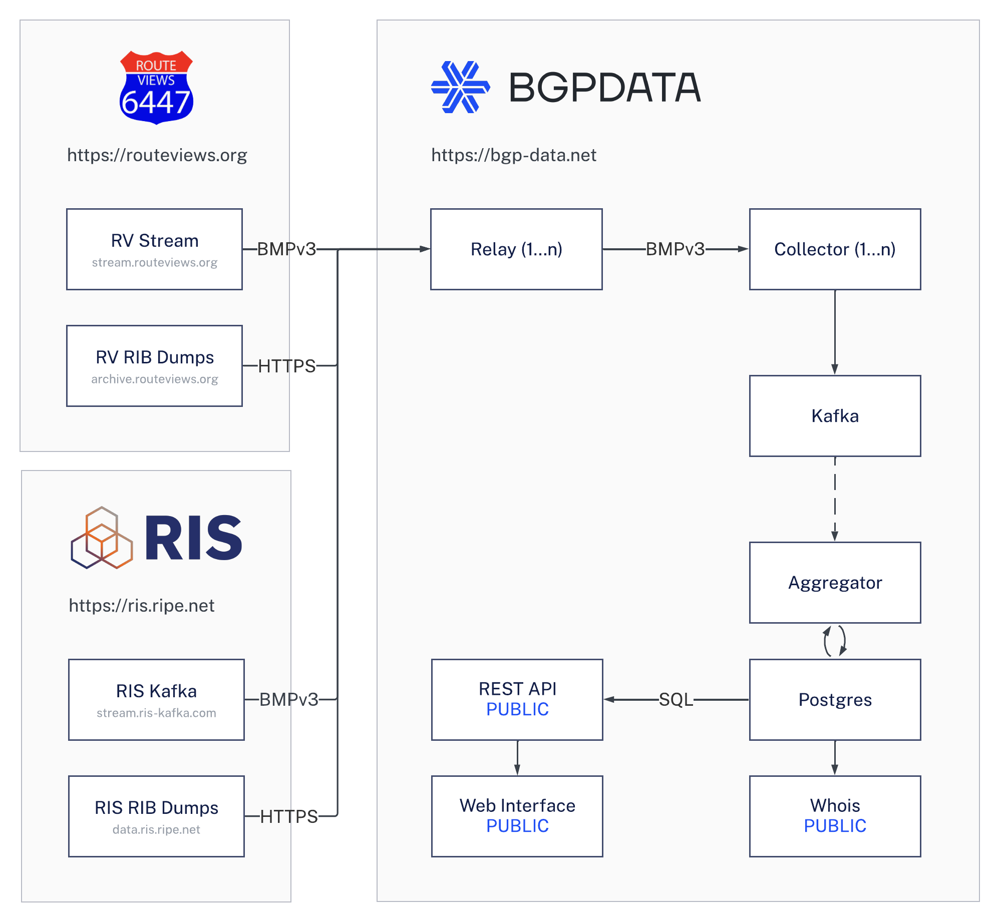

<br />
<br />

---

[https://bgp-data.net](https://bgp-data.net/?ref=github) — A BGP (Border Gateway Protocol) Data Aggregation Service.

BGPDATA helps researchers gain insights into the Internet by providing a extensible way to analyze and inspect terabytes of historical and live global Border Gateway Protocol (BGP) data from [Route Views](https://www.routeviews.org/) and [RIPE NCC RIS](https://ris.ripe.net/). In practice, it provides a real-time, searchable map of how every network on Earth comes together to form the Internet.

## Data Flow
We collect both historical and live BGP data from [Route Views](https://www.routeviews.org/) and [RIPE NCC RIS](https://ris.ripe.net/) collectors to provide comprehensive insights. 



## Prerequisites

Before you begin, ensure you have the following installed on your system:

-   [Docker](https://docs.docker.com/get-docker/)
-   [Docker Compose](https://docs.docker.com/compose/install/)
-   [Git](https://git-scm.com/book/en/v2/Getting-Started-Installing-Git)
-   [Jinja2 CLI](https://github.com/mattrobenolt/jinja2-cli)

## Getting Started

1. Clone the repository:
```bash
git clone --recurse-submodules git@github.com:bgpdata/bgpdata.git
cd bgpdata
```

2. Start the project:
```sh
jinja2 docker-compose.jinja values.yaml | docker compose -f - up
```

> **Note:** This will start collecting from all RouteViews and RIS Collectors. You can further specify to collect from only a specific subset of collector hosts by modifying the `values.yaml` file`.

4. Open:<br>
http://localhost:8080 (Web)<br>
http://localhost:3000 (Grafana)<br>
and try `whois -h localhost AS3582` (WHOIS)

## Contributing

We welcome contributions from researchers and developers! If you need help implementing your ideas or getting started with the project, our team is here to assist you. Whether you're looking to contribute code, suggest improvements, or integrate BGPDATA into your research, we're happy to help you get up and running.

Feel free to reach out to us at [help@bgp-data.net](mailto:help@bgp-data.net) - we're committed to making the onboarding process as smooth as possible and helping you implement your ideas effectively.

## Production Deployment

For production deployment, we use Docker Swarm, but any other orchestration tool may be used.
The recommended system requirements are a Manager and Worker Node with each 60 GB of RAM, 60 GB Swap, 1 TB Datacenter SSD Storage and 48 vCPU cores.
Initial system provisioning may require up to 3 hours to complete, contingent upon your specific configuration parameters.
Once initialization is complete, resource utilization will stabilize at optimal levels.


```sh
# Customize the .env file, then:
curl -fsSL https://downloads.bgp-data.net/docker-compose.yml | docker stack deploy -c - bgpdata
```

Contact us at [help@bgp-data.net](mailto:help@bgp-data.net) if you need any help.

# ACKs

-   [RIS](https://ris.ripe.net/) for providing the data and collector infrastructure
-   [Route Views](https://www.routeviews.org/) for providing the data and collector infrastructure
-   [OpenBMP](https://www.openbmp.org/) for providing the invaluable OpenBMP Suite used in-depth in this project
-   [Tim Evens](https://github.com/TimEvens) for his leading role in the development of the OpenBMP Suite
-   [RIPEstat](https://stat.ripe.net/) for their incredible infrastructure and data visualization
-   [RIPE Atlas](https://atlas.ripe.net/) for providing the RIPE Atlas infrastructure and providing mesaurement data for this project
-   [Massimo Candela](https://www.linkedin.com/in/massimocandela) for his outstanding work on [BGPlay](https://bgplayjs.com/)
-   [Christian Teuschel](https://www.linkedin.com/in/cteuschel/) for his inspiration for this project and operation of RIPEstat at the RIPE NCC
-   [Ben Cartwright-Cox](https://benjojo.co.uk/) for the development of [BGP.tools](https://bgp.tools/) and service to the Internet Community
-   [CAIDA BGPStream](https://bgpstream.caida.org/) for providing a versatile BGP data streaming library
-   [Postmark](https://postmarkapp.com/) for providing the email service

## License

See [LICENSE](LICENSE)
